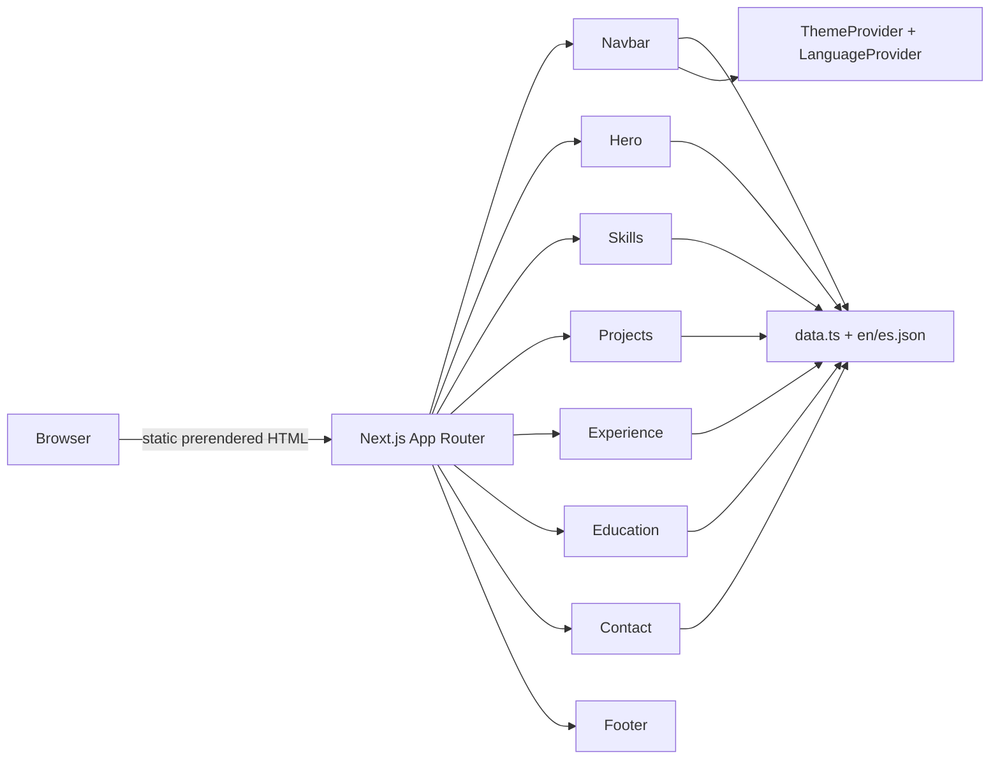

# Uriel Ortiz — Developer portfolio

A bilingual (English/Spanish) personal portfolio and résumé site built with Next.js. It shows the author's profile, skills, featured projects, work history, education and contact info, and serves a downloadable CV.

## What this is

A single page, fully static React app. All content is data driven: text lives in translation dictionaries and structured modules, and presentational components render it. It switches between English and Spanish, and between light and dark themes, without flashing the wrong theme on load.

## Features

- Full English/Spanish switching. The language preference is saved in localStorage.
- Light and dark themes built on CSS custom properties, applied before first paint so there's no flash.
- A sticky, scroll aware navbar with an animated mobile menu.
- A hero section with the name revealed letter by letter, profile stats, and an "about" card in liquid glass with an animated ASCII T-rex standing on it (it shimmers, scrambles near the cursor and runs on hover or tap).
- Filterable skills: category tabs with an animated indicator and grouped chips.
- Featured projects as cards that link out to each project's repo, and to the live URL when there is one. The selected project takes a larger slot and plays an animated demo that simulates its interface; "View demo" on any other card swaps it in.
- An experience timeline with role and responsibility bullets.
- Education, certifications and languages.
- A contact section that copies email or phone to the clipboard with one click, plus a GitHub link.
- Scroll reveal animations done with IntersectionObserver.
- Liquid glass cards and controls (backdrop blur, specular rim, tinted inner light and a cursor-following sheen) over soft purple light spots.
- Button animations: a shine sweep, a slight magnetic pull toward the cursor and small icon motions.
- Faint ASCII dinosaurs across the page background, with parallax; they light up in purple around the cursor.
- A downloadable CV served from public/.
- SEO and OpenGraph metadata in the App Router layout.
- Responsive layout and ARIA labels on interactive controls.

## How it's put together

The production build prerenders the single route to static HTML. There is no backend, API or database.

```
page.tsx  →  layout.tsx (providers)  →  section components  →  data + dictionaries
```

- Providers: LanguageProvider (EN/ES context) and ThemeProvider (dark/light context) wrap the page in layout.tsx.
- Components: section components (Hero, Skills, Projects, Experience, Education, Contact, Navbar, Footer) plus reusable primitives (Reveal, SectionHeading, ProjectCard, ThemeToggle, LanguageToggle, Backdrop, AsciiDino).
- Project demos: src/components/previews/ holds one simulated, self-running interface per project, drawn on a fixed 640×400 stage and scaled to fit the card. They illustrate each app; they are not the deployed apps.
- ASCII art: the background dinosaurs and the pixel T-rex sprite live in src/lib/ascii.ts.
- Data: profile, skills, projects, experience and education live in src/lib/data.ts. All visible text lives in src/i18n/locales/{en,es}.json.
- Theming: CSS custom properties defined in src/app/globals.css, mapped into Tailwind via @theme.



## Tech stack

- Framework: Next.js 16.3.2 (App Router, Turbopack build)
- UI: React 19.2.8
- Language: TypeScript 5 (strict)
- Styling: Tailwind CSS 4 (@tailwindcss/postcss)
- Linting: ESLint (eslint-config-next core-web-vitals + typescript)
- Animation: Motion (motion/react)
- Fonts: Geist / Geist Mono via next/font

No backend, database, API routes or server side data fetching. The app is fully static.

## Project structure

```
portfolio/
├── src/
│   ├── app/
│   │   ├── layout.tsx        # Root layout: providers, fonts, metadata
│   │   ├── page.tsx          # Single page assembling all sections
│   │   ├── globals.css       # Tailwind, CSS variables, theme tokens
│   │   └── favicon.ico
│   ├── components/           # Section + reusable UI components
│   ├── i18n/
│   │   ├── LanguageProvider.tsx
│   │   └── locales/{en,es}.json
│   ├── lib/data.ts           # Profile, skills, projects, experience, education
│   └── theme/ThemeProvider.tsx
├── public/
│   └── Uriel_Ortiz_Rosales_CV.pdf
├── .github/workflows/deploy-pages.yml
├── next.config.ts
├── tsconfig.json
├── postcss.config.mjs
├── eslint.config.mjs
└── package.json
```

## Getting started

### Prerequisites

- Node.js 18.18+ (20.9+ recommended for Next.js 16)
- npm

### Install and run

```bash
npm install
npm run dev
```

Open http://localhost:3000.

### Production build

```bash
npm run build      # type-checks and builds the static bundle
npm start          # serves the production build
```

## Configuration

No environment variables. The app runs without configuration. TypeScript path aliases (@/* → ./src/*) are set in tsconfig.json.

## Testing

There are no automated tests yet. npm run lint runs ESLint:

```bash
npm run lint
```

## Deployment

Deploys to GitHub Pages through a committed GitHub Actions workflow (.github/workflows/deploy-pages.yml). next.config.ts sets output: "export", so the build emits static files that the workflow uploads and publishes to Pages. The site lives at https://urielortizv1000.github.io/uriel-ortiz-portfolio/.

## Security

- No secrets, API keys, tokens or credentials in the repo or its history.
- No environment variables, so there's no .env to leak.
- Fully static: no backend, database or API surface.
- Contact details (email and phone) are public on purpose; it's a portfolio site.
- The only personal data asset is the CV PDF in public/, served as the download.

## What's left

- Unit tests (Vitest) and end to end tests (Playwright).
- A real contact form backed by a serverless function or third party service.
- Individual project detail pages or dynamic routing.
- A CI pipeline to lint and type-check on every push.

## License

MIT. See LICENSE.

## Author

Uriel Ezequiel Ortiz Rosales, Aguascalientes, Mexico.
